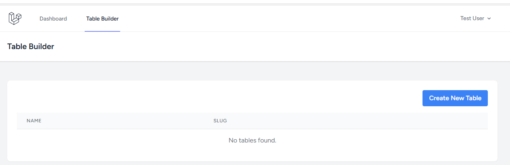
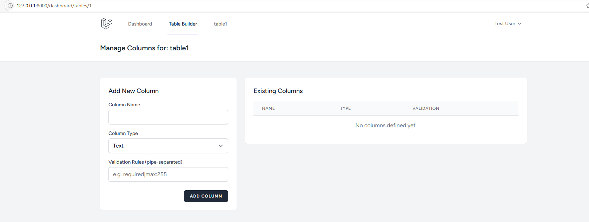
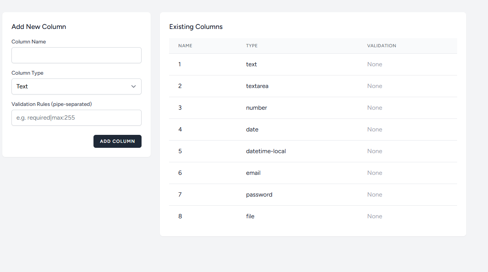
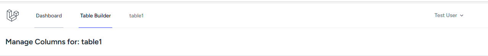
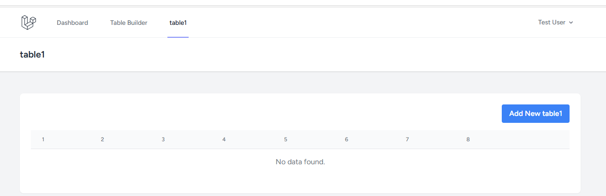
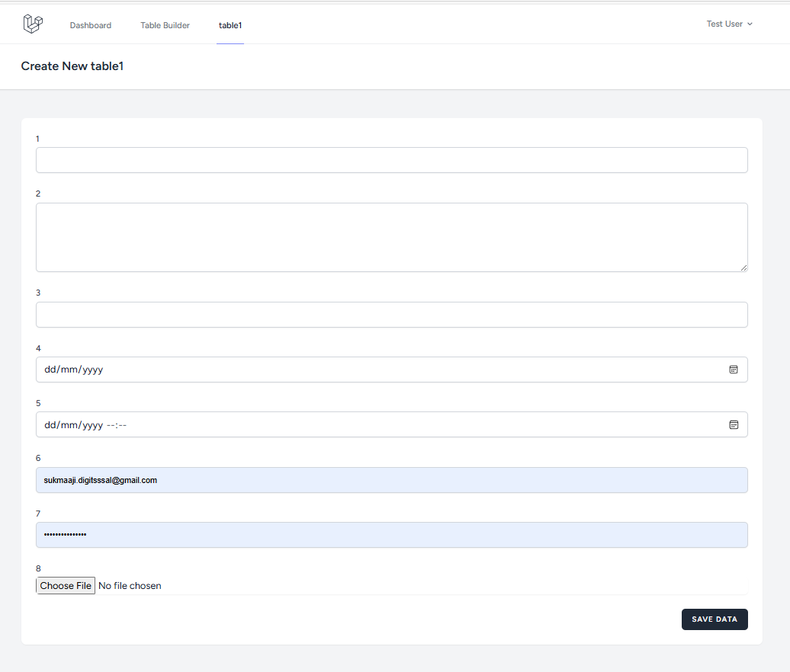
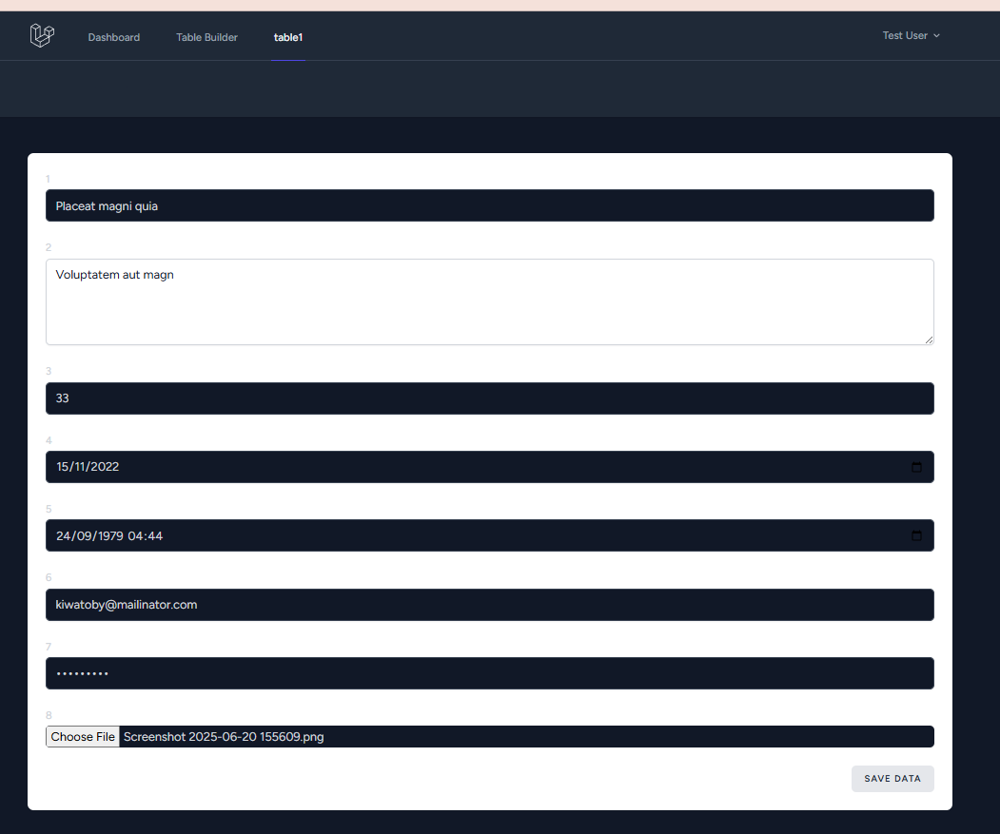
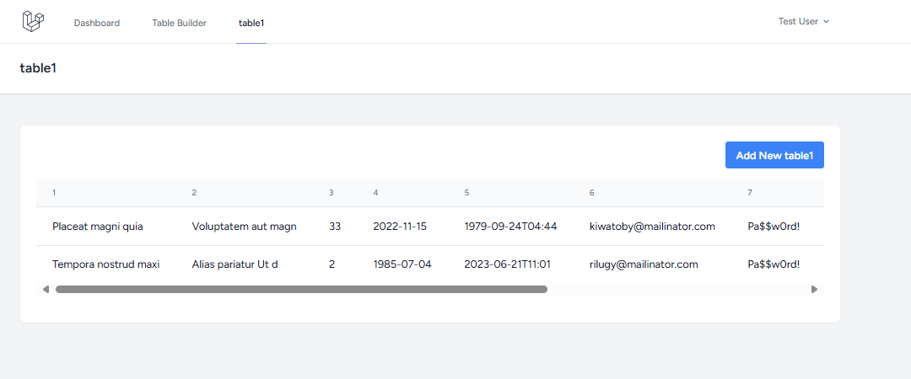

# 🚀 Dynamic Laravel App Builder

<p align="center">
  <a href="https://laravel.com" target="_blank">
    
  </a>
</p>

<p align="center">
  <strong>Capek bikin CRUD berulang-ulang? Aplikasi ini solusinya! Yuk, buat tabel, kolom, dan kelola konten secara dinamis tanpa pusing.</strong>
</p>

<p align="center">
    
    
    
</p>

---

## 🤔 Jadi, Ini Aplikasi Apa Sih?

Singkatnya, **Dynamic Laravel App Builder** ini adalah _tool_ keren yang dibikin pakai Laravel 12 buat bantu kamu ngembangin aplikasi lebih cepat. Kamu bisa bikin tabel database, nambahin kolom, sampai bikin halaman CRUD lengkap, semuanya langsung dari halaman admin. Gak perlu lagi deh capek-capek ngoding dari nol!

Kerennya lagi, setiap kali kamu bikin tabel baru, menu di _sidebar_ bakal otomatis nambah sendiri. Praktis, kan?

## ✨ Fitur-Fitur Andalan

-   **Bikin Tabel Sambil Ngopi ☕**: Buat dan hapus tabel database langsung dari UI. Klik, klik, jadi!
-   **Atur Kolom Sesuka Hati**: Tambah, ubah, atau hapus kolom jadi gampang banget. Tipe datanya juga bisa kamu pilih sendiri.
-   **Menu Ajaib ✨**: Gak usah pusing mikirin _routing_ atau nambahin menu manual. Setiap tabel baru otomatis dapat menu sendiri di _sidebar_.
-   **CRUD Instan**: Halaman buat Tambah, Baca, Ubah, dan Hapus data langsung jadi begitu tabel selesai dibuat. Semuanya dinamis!
-   **Gampang Dipakai**: Tampilannya dibuat sesimpel mungkin, jadi siapa aja bisa langsung pakai.

## 🛠️ Dapur Pacunya

Aplikasi ini dibangun pakai teknologi yang kece-kece, lho:

-   **Framework**: [Laravel 12](https://laravel.com/)
-   **Bahasa**: [PHP 8.2](https://www.php.net/)
-   **Tampilan**: Blade, CSS, JavaScript
-   **Manajemen Paket**: [Composer](https://getcomposer.org/) & [NPM](https://www.npmjs.com/)
-   **Database**: MySQL (tapi bisa juga kok pakai yang lain, asal Laravel dukung)

## 📸 Intip Cara Kerjanya, Yuk!

Biar lebih kebayang, ini dia alur kerja aplikasinya dari awal sampai akhir.

| **Langkah**                  | **Deskripsi**                                                             | **Tangkapan Layar**                                                      |
| ---------------------------- | ------------------------------------------------------------------------- | ------------------------------------------------------------------------ |
| **1. Halaman Utama**         | Ini dia halaman _dashboard_ setelah kamu berhasil masuk.                  |                                               |
| **2. Membuat Tabel Baru**    | Di sini kamu bisa bikin tabel baru, tinggal masukin aja namanya.          |                                             |
| **3. Mengelola Kolom**       | Tabelnya udah jadi? Sekarang tinggal tambahin kolom-kolomnya.             |  <br>  |
| **4. Menu Otomatis**         | Voila! Menu baru langsung muncul di _sidebar_. Ajaib, kan?                |                                             |
| **5. Halaman CRUD**          | Ini halaman buat kelola data yang dibikin otomatis sama sistem.           |                                       |
| **6. Menambah Data Dinamis** | Formulir buat nambah data juga otomatis menyesuaikan sama kolom yang ada. |  <br>  |
| **7. Hasil Akhir**           | Data berhasil masuk dan tampil di tabel. Semuanya lancar jaya!            |                                               |

## 📋 Apa Aja yang Dibutuhin?

Sebelum mulai, pastiin komputermu udah punya ini ya:

-   PHP versi 8.2 atau lebih baru
-   Composer
-   Node.js & NPM / Yarn
-   Web Server (Nginx atau Apache)
-   Database (MySQL, PostgreSQL, dll.)

## ⚙️ Cara Install-nya Gimana?

Gampang banget kok, ikutin aja langkah-langkah ini:

1.  **Clone dulu repository-nya:**

    ```bash
    git clone [https://github.com/sukmaajidigital/your-repository-name.git](https://github.com/sukmaajidigital/your-repository-name.git)
    cd your-repository-name
    ```

2.  **Install semua paket Composer:**

    ```bash
    composer install
    ```

3.  **Lanjut install paket Node.js:**

    ```bash
    npm install
    ```

4.  **Copy file `.env.example` jadi `.env`:**

    ```bash
    cp .env.example .env
    ```

5.  **Setting file `.env` kamu:**
    Buka file `.env` terus sesuaikan settingan database-nya (DB_DATABASE, DB_USERNAME, DB_PASSWORD).

6.  **Bikin _application key_ baru:**

    ```bash
    php artisan key:generate
    ```

7.  **Jalankan migrasi database:**

    ```bash
    php artisan migrate
    ```

8.  **Compile aset-aset frontend:**

    ```bash
    npm run dev
    ```

9.  **Jalankan server-nya!**
    ```bash
    php artisan serve
    ```
    Yeay! Sekarang aplikasinya udah bisa diakses di `http://127.0.0.1:8000`.

## 🤝 Mau Ikutan Bikin Keren?

Mau ikutan ngembangin? Boleh banget! Kami seneng banget kalau kamu mau bantu. Caranya gampang:

1.  **Fork** dulu repository ini.
2.  Bikin **branch** baru (`git checkout -b fitur/FiturKeren`).
3.  **Commit** perubahanmu (`git commit -m 'Nambahin fitur keren A'`).
4.  **Push** ke branch-mu (`git push origin fitur/FiturKeren`).
5.  Langsung aja bikin **Pull Request**.

Kalau nemu bug atau punya ide, jangan sungkan buat bikin **Issue** baru, ya!

## 📄 Lisensi

Proyek ini pakai Lisensi MIT. Cek aja file `LICENSE` buat info lengkapnya.

## 📞 Kontak

Ada yang mau ditanyain atau sekadar ngobrol? Langsung aja kontak aku ya:

**[Nama Kamu]** - [sukmaaji.digital@gmail.com](mailto:sukmaaji.digital@gmail.com)

Link Proyek: [https://github.com/sukmaajidigital/sukBuilder](https://github.com/sukmaajidigital/sukBuilder)
